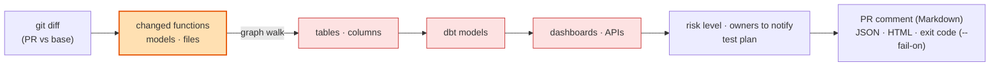

<h1 align="center">impactgraph</h1>

<p align="center"><b>What breaks if I merge this?</b> — a pre-merge safety net for code <i>and</i> data, built on <a href="https://github.com/sumit-gupta03/datagraph">datagraph</a>.</p>

<p align="center">
  <a href="https://pypi.org/project/impactgraph/"></a>
  <a href="https://pypi.org/project/impactgraph/"></a>
  <a href="https://github.com/sumit-gupta03/impactgraph/actions/workflows/ci.yml"></a>
  <a href="https://github.com/sumit-gupta03/impactgraph/blob/main/LICENSE"></a>
</p>



`impactgraph` takes the git diff of a pull request, maps it onto a deterministic dependency graph
(Python/JS functions → Lambdas/APIs → tables → dbt models → columns → dashboards) and reports the
**blast radius, risk level, owners to notify and a test plan** — as a terminal report, JSON, a
Markdown PR comment, or an interactive HTML view — with an exit code you can gate CI on.

It is the pull-request product built on **[datagraph](https://github.com/sumit-gupta03/datagraph)**,
the engine that holds everything data-related: extractors (Python, dbt, SQL, warehouse metadata,
Airflow, Lambda, JS, OpenLineage, DataHub, plugins), lineage, relationships, profiling, the
knowledge base for AI assistants and the MCP server. impactgraph re-exports the whole engine, so one
install gives you both.

```
git diff  ──►  changed functions / models / files  ──►  graph walk  ──►  risk · owners · tests
```

> **New here?** Run the guided tour - it creates a demo git repo, makes a change and shows every feature:
> ```bash
> python examples/example_impactgraph.py
> ```

## Install

```bash
pip install impactgraph            # core (pulls in datagraph)
pip install "impactgraph[sql]"     # + sqlglot for .sql files and column lineage
pip install "impactgraph[all]"     # + yaml, anthropic (AI explanation), mcp
```

## 30-second use

```bash
# uncommitted changes in the working tree, Python code + dbt
impactgraph check --repo . --dbt-manifest target/manifest.json

# a PR branch against main, Markdown for the PR comment, fail the job at HIGH or above
impactgraph check --repo . --base origin/main --format markdown --fail-on HIGH

# machine-readable, and keep the graph for later questions
impactgraph check --repo . --base origin/main --format json --save-graph impactgraph.json
impactgraph impact dbt:customer --graph impactgraph.json       # any datagraph command passes through
impactgraph lineage table:prod.analytics.dim_customer --graph impactgraph.json
impactgraph context dim_customer --graph impactgraph.json      # knowledge pack for an AI assistant
```

Typical output (text format):

```
changed files (1): src/etl/load_customers.py
Changed: func:src/etl/load_customers.py::load_customers   risk HIGH (score 20.0)
├── ▤ prod.analytics.customer (table) via writes_to
│   └── ◆ dim_customer (dbt_model) via depends_on
│       └── ◆ fact_booking (dbt_model) via depends_on
│           ├── 📊 revenue_report (dashboard) via exposes
│           └── 📊 customer_dashboard (dashboard) via exposes
Notify: finance (revenue_report) · growth (customer_dashboard)
Recommended tests:
  ✓ pytest -k load_customers
  ✓ dbt build --select dim_customer+ fact_booking+
  ✓ Manually validate 'revenue_report' after deploy
```

`check` options: `--base/--head`, `--code DIR` (code root if not the repo root), `--graph FILE` / `--save-graph FILE --update`,
every datagraph build input (`--dbt-manifest --dbt-catalog --sql --airflow --lambda --js --warehouse --openlineage --lineage-file --datahub`),
`--max-depth`, `--no-inferred` (artifact-backed edges only), `--format text|json|markdown`, `--html FILE`, `--fail-on LEVEL`, `-o FILE`.

## GitHub Action — a comment on every PR

```yaml
# .github/workflows/impact.yml
name: change impact
on: pull_request
permissions: { contents: read, pull-requests: write }
jobs:
  impact:
    runs-on: ubuntu-latest
    steps:
      - uses: actions/checkout@v4
        with: { fetch-depth: 0 }
      - uses: actions/setup-python@v5
        with: { python-version: "3.12" }
      - uses: sumit-gupta03/impactgraph@main
        with:
          repo-path: src
          dbt-manifest: target/manifest.json
          fail-on: CRITICAL        # LOW | MEDIUM | HIGH | CRITICAL | NONE
```

The action installs impactgraph, diffs the PR against its base, posts the Markdown report as a PR comment
(and to the job summary) and exposes `level` as an output.

## Python API

```python
from impactgraph import check, to_markdown

result = check(".", base="origin/main", inputs={"dbt_manifest": "target/manifest.json"})
print(result.level, result.score, result.changed_files)
print(result.analysis.recommended_tests, result.analysis.owners)
print(to_markdown(result))                     # the PR comment
assert not result.breaches("HIGH")
```

Everything from datagraph is re-exported (`from impactgraph import ImpactGraph, analyze_impact, DbtExtractor, ...`).

## How it works (and why it is trustworthy)

1. **Deterministic graph** — built from artifacts only (AST, manifests, SQL parse, metadata, git). No LLM builds nodes.
2. **Typed edges with an impact direction** — `contains`, `writes_to`, `exposes` flow forward; `calls`, `imports`, `depends_on` flow backward — so a change propagates the way reality does.
3. **Provenance** — every edge is `extracted`, `inferred` or `llm`; `--no-inferred` drops heuristics.
4. **Diff → function** — changed line ranges map to the exact functions/models touched, not whole files.
5. **Risk, owners, tests** — a weighted score over affected node types (dashboards and tables weigh more), owners collected from dbt/DataHub metadata, test suggestions per node type.
6. **AI only explains** — `impactgraph explain ...` (optional `[ai]`) narrates the result; it never changes it.

## Use it from AI coding assistants

Copy `skills/impactgraph/` to `.claude/skills/impactgraph/` (or `~/.claude/skills/`) and ask
*"is this change safe?"*, *"what breaks if I change load_customers?"*. For MCP, the knowledge base
(`wiki`, `context`) and data analysis (`relationships`, `profile`) use datagraph directly.

## impactgraph vs datagraph

| | impactgraph | datagraph |
|---|---|---|
| Audience | developers, reviewers, CI | data engineers, analysts, AI-assistant builders |
| Question | *will this PR break something?* | *where does this data come from, how is it related, what does it look like, give my assistant the context* |
| Ships | `check` / `pr` CLI, GitHub Action, skill; passes everything else through | the engine: extractors, lineage, relationships, profiling, wiki/context, MCP, plugins |
| Graph & node ids | identical — a graph built by one is readable by the other | |

## Security

impactgraph inherits datagraph's security model (deterministic core, LLM only explains, prompts wrap repo/warehouse text as
untrusted data, DSN passwords never stored or logged, profiling masks sensitive columns, quoted identifiers, escaped HTML).
The PR comment is plain Markdown built from node names in *your* repository; the GitHub Action needs only `pull-requests: write`
and the default `GITHUB_TOKEN`. See the [datagraph security notes](https://github.com/sumit-gupta03/datagraph#security).

## Development

```bash
git clone https://github.com/sumit-gupta03/impactgraph && cd impactgraph
pip install -e ".[dev]"     # pulls datagraph-core from PyPI (the engine; import name datagraph)
pytest
```

History: versions ≤ 0.5 of this repository contained the whole engine; it now lives in
[datagraph](https://github.com/sumit-gupta03/datagraph) and impactgraph (≥ 0.6) is the thin PR-focused layer.

## Authors

Sumit Kumar Gupta and Nitish Pradhan.

## License

MIT
